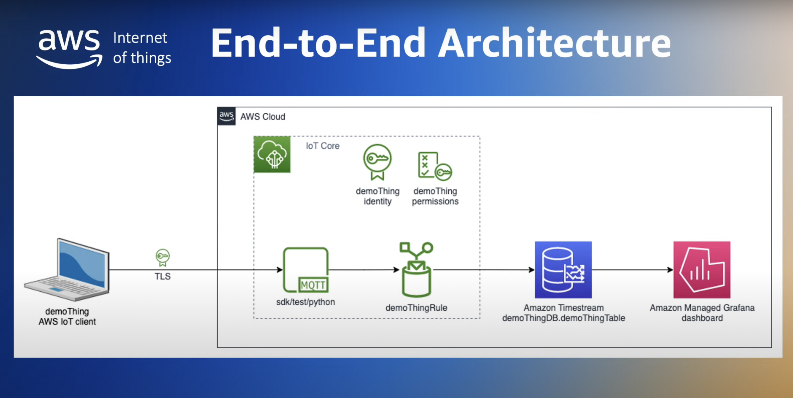

# IoT System Documentation

This documentation provides a technical overview of the IoT system built using AWS IoT Core, NodeJS, and Amazon Elastic Kubernetes Service (EKS). It covers the steps involved in setting up the system, including messaging infrastructure, device code, central control system, and deployment on EKS.

# System Diagram



## Table of Contents

- [Introduction](#introduction)
- [Prerequisites](#prerequisites)
- [Setting up AWS IoT Core](#setting-up-aws-iot-core)
- [Defining MQTT Topics](#defining-mqtt-topics)
- [Writing Device Code](#writing-device-code)
- [Connecting Devices to AWS IoT Core](#connecting-devices-to-aws-iot-core)
- [Central Control System](#central-control-system)
- [Deploying on EKS using Terraform](#deploying-on-eks-using-terraform)
- [Monitoring](#monitoring)
- [Testing](#testing)

## Introduction

The IoT system allows for the integration of 10 devices using AWS IoT Core, NodeJS, and EKS. It enables communication between devices, a central control system, and users interacting with the system through natural language. The system leverages MQTT as the messaging protocol and EKS for deployment and management.

## Prerequisites

Before setting up the IoT system, ensure you have the following prerequisites in place:

- Access to an AWS account
- AWS CLI installed and configured with appropriate permissions
- Terraform installed locally

## Setting up AWS IoT Core

To set up AWS IoT Core, follow these steps:

1. Create an AWS IoT Core instance in the AWS Management Console or using the AWS CLI.
2. Configure the necessary IoT Core settings such as policies, certificates, and rules to enable device communication and secure data transfer.

## Defining MQTT Topics

MQTT topics represent different types of data or actions within the IoT system. Define the MQTT topics based on your system requirements. For example:

- `devices/alarm/generic`
- `devices/alarm/logic`
- `devices/temperature/ambient`
- `devices/temperature/external`
- `devices/humidity/relative`
- `devices/humidity/set`
- `devices/humidity/effective_set`
- `...`

You can see the entire list here: https://lightmnd.github.io/gcp-iot-air-devices-system/

## Writing Device Code

Each device within the IoT system requires specific device code. The device code, written in NodeJS, connects to the AWS IoT Core broker and publishes or subscribes to MQTT topics based on its functionality. Implement device-specific logic such as sensor readings, actuator control, or data processing within the code.

## Connecting Devices to AWS IoT Core

To connect devices to AWS IoT Core, utilize the AWS IoT Device SDKs available for various programming languages. These SDKs provide the necessary functionalities to authenticate, publish, and subscribe to MQTT topics. Configure the device code with the required AWS IoT Core credentials, such as device certificates, and establish the MQTT connection.

## Central Control System

The central control system manages the IoT devices and communicates with the devices using MQTT. It is written in NodeJS and incorporates an MQTT client to subscribe to relevant topics and receive data from the devices. Implement logic within the central control system to process incoming data, perform analytics, and control the devices based on desired actions.

## Deploying on EKS using Terraform

Use Terraform to provision the necessary resources on EKS and deploy the IoT system. The provided Terraform template sets up an EKS cluster for deployment. Adjust the template to include the required resources such as AWS IoT Core, device code, and the central control system. Ensure you have the necessary credentials for AWS authentication. Run Terraform commands `init`, `plan`, and `apply` to deploy the system on EKS.

## Monitoring

Configure the AWS IoT Rule to send data to Timestream:
In the AWS IoT Core console, create a rule that captures the MQTT messages published by your devices.
Configure the rule's action to send the captured data to Amazon Timestream.
Map the MQTT message fields to the appropriate Timestream table columns.

Set up Grafana:
Install and configure Grafana on your local machine or a server.
Add the Timestream data source to Grafana by specifying the Timestream endpoint and authentication details.

In the AWS IoT Core console, create a rule that captures the MQTT messages published by your devices.
Configure the rule's action to send the captured data to Amazon Timestream.
Map the MQTT message fields to the appropriate Timestream table columns.

Create a Grafana dashboard:
Design a dashboard in Grafana to visualize the data from Timestream.
Configure queries in Grafana to retrieve and display the desired data from Timestream.
Add visualizations such as graphs, charts, and tables to represent the data.

## Testing

To test the code (for example code 23) in the AWS IoT MQTT test client, follow these steps:

Make sure you have a device connected to AWS IoT Core and that it is configured to publish data on the correct port.
Open the AWS IoT Core MQTT test client.
In the "Publish" section of the MQTT test client, set the "Topic" field with the value

```
device/{device_name}/data
```

replacing {device_name} with your device name.
Make sure that the "Payload" field is set as JSON and enter the example data for the "External Air Flow Rate" field:

Example:

```
{
  "23": 30.2
}
```

This will send a value of 30.2 for the "air flow rate" field to the device.
Click the "Publish" button to send the message to the device.
Check on your device that the data has been received correctly and that the "Outdoor Air Flow Rate" field is updated with the value sent.
This way you can test the receipt of the "Outdoor Air Flow Rate" data on your device using the AWS IoT Core MQTT test client.

---

This technical documentation provides an overview of the IoT system, including the steps involved and the necessary code snippets. Use this document as a guide to set up and understand the different components of the system. Adjust the code and configurations according to your specific requirements and use cases.
